# 🎨 FFT Image Processor

<div align="center">


**✨ 基于C++和OpenGL的交互式图像频域分析与滤波处理软件 ✨**

[](https://github.com/Linductor-alkaid/fft-image-processor/releases)
[](https://isocpp.org/)
[](https://www.opengl.org/)
[](https://github.com/Linductor-alkaid/fft-image-processor)
[](LICENSE)

[🚀 快速开始](#-快速开始) • [📸 功能特性](#-功能特性) • [🔧 安装指南](#-安装指南) • [📖 使用教程](#-使用教程) • [🤝 贡献指南](#-贡献指南)

</div>

---

## 🌟 项目简介

FFT Image Processor 是一款专业的图像频域处理软件，采用现代化的GUI设计，为图像处理爱好者和研究人员提供直观、高效的频域分析工具。无论是去除图像噪声、增强边缘细节，还是进行频谱分析，本软件都能轻松胜任。

### 💡 为什么选择 FFT Image Processor？

- 🎯 **专注频域处理**：深度优化的FFT算法，快速准确
- 🖼️ **实时预览**：参数调整即时反馈，所见即所得
- 🎮 **3D可视化**：独特的频域3D展示，直观理解频谱分布
- 🌈 **现代化界面**：基于Dear ImGui，美观易用
- 🚀 **高性能**：充分利用现代GPU，流畅运行

---

## 📸 功能特性

<table>
<tr>
<td width="50%">

### 🔬 核心功能

- **⚡ 2D快速傅里叶变换（FFT）**
  - Cooley-Tukey算法优化实现
  - 自动尺寸调整（2的幂次）
  - 双精度浮点运算

- **🎛️ 专业滤波器组**
  - 🔵 低通滤波器 - 平滑去噪
  - 🔴 高通滤波器 - 边缘增强
  - 🟢 带通滤波器 - 特征提取

- **📊 图像质量评估**
  - MSE（均方误差）
  - PSNR（峰值信噪比）
  - SSIM（结构相似性）

</td>
<td width="50%">

### 🎨 界面特性

- **🪟 灵活的多窗口系统**
  - 可拖拽、可调整大小
  - 自由布局工作空间
  - 独立功能模块

- **🎨 丰富的可视化选项**
  - 5种专业颜色映射
  - 实时直方图显示
  - 频谱切片分析

- **🌏 国际化支持**
  - 自动语言检测
  - 中英文界面切换
  - 完整的Unicode支持

</td>
</tr>
</table>

### ✨ 特色功能

<div align="center">

| 🖱️ **拖拽加载** | 🔄 **实时滤波** | 📈 **3D频谱** | 📊 **专业分析** |
|:---:|:---:|:---:|:---:|
| 直接拖拽图像到窗口 | 参数改变即时生效 | 交互式3D频域展示 | 完整的统计数据 |

</div>

---

## 🔧 安装指南

### 📋 系统要求

<table>
<tr>
<td>

**最低配置** 💻
- OS: Windows 7 / Linux / macOS 10.12+
- CPU: x64 with SSE2
- RAM: 4GB
- GPU: OpenGL 3.3
- Storage: 100MB

</td>
<td>

**推荐配置** 🚀
- OS: Windows 10 / Ubuntu 20.04 / macOS 12+
- CPU: Intel i5 / AMD Ryzen 5
- RAM: 8GB+
- GPU: 独立显卡 OpenGL 4.0+
- Storage: 500MB

</td>
</tr>
</table>

### 🛠️ 编译步骤

<details>
<summary><b>🐧 Linux / macOS</b></summary>

```bash
# 📦 安装依赖（Ubuntu/Debian）
sudo apt-get update
sudo apt-get install -y build-essential cmake libglfw3-dev libglew-dev libglm-dev

# 🍎 安装依赖（macOS）
brew install cmake glfw glew glm

# 📥 克隆项目
git clone https://github.com/Linductor-alkaid/fft-image-processor.git
cd fft-image-processor

# 🔨 编译
mkdir build && cd build
cmake ..
make -j$(nproc)

# 🚀 运行
./fft_image_processor
```

</details>

<details>
<summary><b>🪟 Windows (Visual Studio)</b></summary>

```powershell
# 📥 克隆项目
git clone https://github.com/Linductor-alkaid/fft-image-processor.git
cd fft-image-processor

# 🔨 生成VS项目
mkdir build && cd build
cmake .. -G "Visual Studio 16 2019" -A x64

# 🚀 编译运行
cmake --build . --config Release
.\Release\fft_image_processor.exe
```

</details>

---

## 📖 使用教程

### 🚀 快速开始

```mermaid
graph LR
    A[🚀 启动程序] --> B[📂 加载图像]
    B --> C[⚡ 执行FFT]
    C --> D[🎛️ 应用滤波]
    D --> E[💾 保存结果]
    
    style A fill:#e1f5fe
    style B fill:#fff3e0
    style C fill:#f3e5f5
    style D fill:#e8f5e9
    style E fill:#fce4ec
```

<div align="center">



</div>

### ⌨️ 快捷键

<div align="center">

| 快捷键 | 功能 | | 快捷键 | 功能 |
|:---:|:---:|:---:|:---:|:---:|
| `Ctrl+O` | 📂 打开图像 | | `Ctrl+S` | 💾 保存图像 |
| `Ctrl+T` | 🎨 创建测试图像 | | `Ctrl+Shift+S` | 💾 另存为 |
| `Alt+F4` | ❌ 退出程序 | | `拖拽` | 📥 快速加载 |

</div>

### 📁 支持格式

<div align="center">

| 类型 | 格式支持 |
|:---:|:---|
| **输入** 📥 | PNG • JPG/JPEG • BMP • TGA • GIF • PSD • HDR • PIC |
| **输出** 📤 | PNG • JPG • BMP • TGA |

</div>

---

## 🎯 核心算法

### 🔬 FFT实现原理

```cpp
// Cooley-Tukey FFT算法
// 时间复杂度: O(N log N)
// 空间复杂度: O(N)
```

### 🎛️ 滤波器类型

<div align="center">

| 滤波器 | 用途 | 效果 |
|:---:|:---:|:---:|
| **低通** 🔵 | 去噪、平滑 | 保留低频，去除高频噪声 |
| **高通** 🔴 | 边缘检测 | 保留高频，增强细节 |
| **带通** 🟢 | 特征提取 | 保留特定频率范围 |

</div>

---

## 🐛 故障排查

<details>
<summary><b>❓ 常见问题解答</b></summary>

### 🚫 程序无法启动
- ✅ 更新显卡驱动至最新版本
- ✅ 确认GPU支持OpenGL 3.3+
- ✅ 尝试管理员权限运行

### 🖼️ 图像加载失败
- ✅ 避免路径包含中文或特殊字符
- ✅ 检查图像格式是否支持
- ✅ 确认文件未损坏

### 🀄 中文显示异常
- ✅ 下载中文字体文件到 `assets/fonts/`
- ✅ 支持字体：NotoSansCJK、思源黑体等

### 🎮 3D视图黑屏
- ✅ 更新OpenGL驱动
- ✅ 降低渲染分辨率
- ✅ 检查GPU兼容性

</details>

---

## 🤝 贡献指南

我们欢迎所有形式的贡献！无论是报告Bug、提出新功能建议，还是提交代码，都将使这个项目变得更好。

<div align="center">


</div>

### 📝 贡献步骤

1. **Fork** 本仓库
2. **创建** 功能分支 (`git checkout -b feature/AmazingFeature`)
3. **提交** 你的更改 (`git commit -m '✨ Add some AmazingFeature'`)
4. **推送** 到分支 (`git push origin feature/AmazingFeature`)
5. **发起** Pull Request

---

## 📄 许可证

本项目基于 MIT 许可证开源 - 查看 [LICENSE](LICENSE) 文件了解更多细节

---

## 🙏 致谢

<div align="center">

特别感谢以下开源项目的支持：

| 项目 | 描述 |
|:---:|:---|
| [Dear ImGui](https://github.com/ocornut/imgui) | 🎨 优秀的即时模式GUI库 |
| [ImPlot](https://github.com/epezent/implot) | 📊 强大的绘图扩展 |
| [STB Libraries](https://github.com/nothings/stb) | 🖼️ 简洁高效的图像处理 |
| [GLFW](https://www.glfw.org/) | 🪟 跨平台窗口管理 |
| [GLM](https://github.com/g-truc/glm) | 🔢 OpenGL数学库 |

</div>

---

## 📮 联系方式

<div align="center">

### 👨‍💻 开发者：Linductor-alkaid

[](https://github.com/Linductor-alkaid)
[](mailto:2052046346@qq.com)

### 🔗 项目链接

[](https://github.com/Linductor-alkaid/fft-image-processor)
[](https://github.com/Linductor-alkaid/fft-image-processor/issues)
[](https://github.com/Linductor-alkaid/fft-image-processor/stargazers)

</div>

---

<div align="center">

**🎨 让频域分析变得简单而有趣！**

<sub>Made with ❤️ by Linductor-alkaid</sub>

</div>